# Architecture & Technical Implementation Guide

This guide details the technical internals, data models, and component architecture of **OmniBrief**.

---

## 1. Directory Structure

```
d:\projects\devpost/
├── docs/                             # Architecture, requirements, progress & submission guides
│   ├── REQUIREMENTS.md
│   ├── PROBLEM_AND_SOLUTION.md
│   ├── ARCHITECTURE_GUIDE.md
│   ├── PROGRESS_AND_ROADMAP.md
│   └── SUBMISSION_PITCH_GUIDE.md
├── src/
│   ├── app/
│   │   ├── api/
│   │   │   └── analyze/
│   │   │       └── route.ts          # Multi-agent orchestrator API route
│   │   ├── globals.css               # Dark theme tokens & @xyflow/react stylesheet imports
│   │   ├── layout.tsx                # App root layout with font and metadata
│   │   └── page.tsx                  # Main interface (Search, Tabs, Canvas, Dossier)
│   ├── components/
│   │   ├── canvas/
│   │   │   ├── IntelligenceCanvas.tsx # React Flow canvas with controls, minimap, legend
│   │   │   ├── NodeInspectorDrawer.tsx# Slide-in deep-dive inspector for clicked nodes
│   │   │   └── nodes/
│   │   │       ├── RootEntityNode.tsx # Glowing central target entity node
│   │   │       ├── CompetitorNode.tsx # Direct/indirect rival cards with pricing
│   │   │       ├── TechStackNode.tsx  # Architecture teardown cards
│   │   │       ├── MoatNode.tsx       # Defensibility score & risk badges
│   │   │       └── WhitespaceNode.tsx # High-impact market white-space cards
│   │   ├── config/
│   │   │   └── ApiConfigModal.tsx     # In-app Nebius & Tavily key configuration
│   │   └── dossier/
│   │       └── ExecutiveDossier.tsx   # Comprehensive tabbed report & export actions
│   ├── lib/
│   │   ├── graphMapper.ts             # Relational topology layout & edge generator
│   │   ├── nebius.ts                  # Nebius Token Factory client & fallback engine
│   │   └── tavily.ts                  # Tavily AI Search client & scraper
│   └── types/
│       └── omnibrief.ts               # Core TypeScript domain models
├── LICENSE                            # MIT License
├── README.md                          # Repository overview & setup instructions
└── package.json
```

---

## 2. Multi-Agent Data Pipeline

```mermaid
sequenceDiagram
    autonumber
    actor User as User / Judge
    participant App as Next.js Client
    participant API as /api/analyze Route
    participant Tavily as Tavily AI Search API
    participant Nebius as Nebius Token Factory (NVIDIA Nemotron)
    participant Compiler as Graph Topology Compiler
    participant Canvas as XYFlow Interactive Canvas

    User->>App: Submits target entity / query
    App->>API: POST /api/analyze { query, nebiusKey, tavilyKey, model }
    
    rect rgb(24, 24, 27)
        Note over API,Tavily: Stage 1: Scout Agent
        API->>Tavily: POST /search { query, depth: "advanced", max_results: 5 }
        Tavily-->>API: Raw market results, pricing & GitHub discussions
    end

    rect rgb(24, 24, 27)
        Note over API,Nebius: Stage 2: Reasoning Agent
        API->>Nebius: POST /chat/completions (NVIDIA Nemotron 3 Ultra)
        Nebius-->>API: Structured Due-Diligence JSON
    end

    rect rgb(24, 24, 27)
        Note over API,Compiler: Stage 3: Topology Compilation
        API->>Compiler: buildGraphFromReport(report)
        Compiler-->>API: { nodes: Node[], edges: Edge[] }
    end

    API-->>App: JSON { report }
    App->>Canvas: Renders relational nodes, edges & minimap
    App-->>User: Visual Canvas + Dossier + Confetti
```



---

## 3. Nebius Token Factory Integration (`src/lib/nebius.ts`)

Nebius Token Factory exposes OpenAI-compatible REST endpoints optimized for NVIDIA GPUs:
- **Base URL:** `https://api.tokenfactory.nebius.com/v1` (or `https://api.studio.nebius.com/v1`)
- **Default Model:** `nvidia/Llama-3.1-Nemotron-70B-Instruct-HF`
- **Ultra Reasoning Model:** `nvidia/nemotron-4-340b-instruct`
- **Fast Nano Model:** `meta-llama/Meta-Llama-3.1-8B-Instruct`

### Enforcement of Structured JSON Schema
The Reasoning Agent sends a strict system prompt mandating JSON output format:
```typescript
const response = await fetch(`${NEBIUS_BASE_URL}/chat/completions`, {
  method: 'POST',
  headers: {
    'Content-Type': 'application/json',
    Authorization: `Bearer ${apiKey}`,
  },
  body: JSON.stringify({
    model: modelName,
    messages: [
      { role: 'system', content: systemPrompt },
      { role: 'user', content: promptWithTavilyContext },
    ],
    temperature: 0.2,
    response_format: { type: 'json_object' },
  }),
});
```

---

## 4. XYFlow Canvas Topology Mechanics (`src/lib/graphMapper.ts`)

The graph generator calculates coordinate positions dynamically around the central target node:

```
                         [Competitor 1]    [Competitor 2]    [Competitor 3]
                              ▲                 ▲                 ▲
                              │                 │                 │
[Moat 1] ◄──────┐             │                 │             ┌──────► [White-Space 1]
[Moat 2] ◄──────┼─────── [ ROOT TARGET ENTITY NODE ] ─────────┼──────► [White-Space 2]
[Moat 3] ◄──────┘             │                 │             └──────► [White-Space 3]
                              ▼                 ▼                 ▼
                         [Tech Stack 1]   [Tech Stack 2]   [Tech Stack 3]
```

- **Root Node (x: 500, y: 350):** 4 connection handles on Top, Bottom, Left, Right.
- **Competitors (y: 40):** Spaced horizontally across the top with Rose red animated edges.
- **Architecture (y: 640):** Positioned along the bottom with Cyan blue animated edges.
- **Threat Moats (x: -220):** Stacked vertically along the left with Amber orange animated edges.
- **White-Space Opportunities (x: 1150):** Stacked vertically along the right with Emerald green animated edges.

---

## 5. Model Context Protocol (MCP) Export Schema

OmniBrief implements 1-click export of an official **Model Context Protocol (MCP)** context bundle. This allows developers to immediately drop the synthesized competitive and architectural intelligence into AI IDEs:

```json
{
  "$schema": "https://modelcontextprotocol.io/schema/context.json",
  "version": "1.0.0",
  "type": "market-and-architecture-due-diligence",
  "entity": "Linear.app",
  "moatScore": 92,
  "models": {
    "reasoning": "nvidia/Llama-3.1-Nemotron-70B-Instruct-HF",
    "infrastructure": "Nebius Token Factory / Nebius AI Cloud"
  },
  "sources": [...],
  "competitors": [...],
  "architecture": [...],
  "moats": [...],
  "whitespaceOpportunities": [...],
  "summary": "..."
}
```

---

## 6. Zero-Setup Autonomous Simulation Fallback

To ensure the project is immediately testable by hackathon judges without forcing them to create API accounts or burn credits, `src/lib/nebius.ts` and `src/lib/tavily.ts` include an intelligent heuristic synthesis engine. If API keys are omitted:
1. OmniBrief detects keywords in the query (e.g., `Linear`, `Cursor`, `Perplexity`, `Supabase`, or custom domains).
2. Generates tailored competitive data, real architectural tradeoffs, and citations.
3. Renders the full XYFlow graph and executive dossier with 100% fidelity.
4. When keys are supplied in the Settings modal, it seamlessly transitions to live remote API execution!
